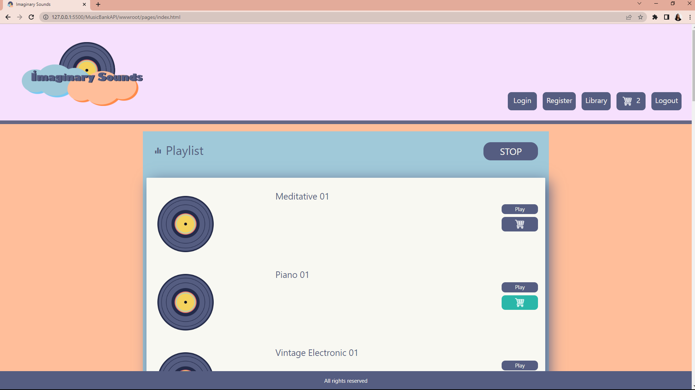
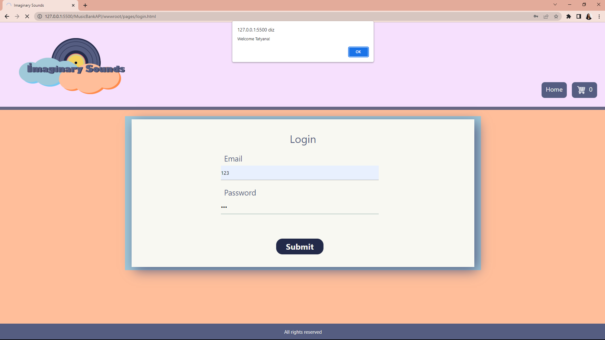

<h2>Imaginary Sounds - Sounds Asset Store</h2>
 
<ul>
<li>HTML</li>
<li>CSS</li>
<li>JS</li>
<li>C#</li>
<li>Microsonf SQL Server</li>
<li>RabbitMQ</li>
<li>TDD</li>
</ul>
 

Esse trabalho foi desenvolvido durante o Módulo 03 do Curso DEVinHouse do Senai. Seu escopo foi o desenvolvimento de um projeto de livre escolha que, entretanto, deveria contar com alguns requisitos. Entre eles: frontend amigável desenvolvido com javascript, modelagem e consulta a banco de dados, backend desenvolvido com C#, testes unitários e a utilização de filas via RabbitMQ.

 

Optei pelo desenvolvimento de um site com cadastro de usuários e download de músicas. Após a entrega e avaliação, continuarei desenvolvendo esse projeto, para que, futuramente, ele possa se tornar uma loja para o licenciamento de músicas e efeitos sonoros. 

 

O fronted do site foi desenvolvido com HTML5, CSS3 e JS. O site é constituído por cinco páginas: Home, Carrinho, Biblioteca, Registro e Login. O backend utiliza a linguagem C#. Também é utilizado banco de dados relacional SQL.

 
<h3>Index</h3>

Na página inicial, é feita uma requisição para o banco de dados que permite a listagem dos áudios disponíveis para adição ao carrinho. Apenas é possível a navegação para as páginas de carrinho e biblioteca se o usuários estiver logado. Para isso, foi desenvolvido no front uma função para validar o nome do usuário que, futuramente, será substituída por um sistema seguro de autenticação. Provavelmente, Razor Page. Na página inicial, assim como na biblioteca também é possível executar e parar o áudio.

 
<h3>Register</h3>

Na página de registro, os dados do usuário são encaminhados para uma fila em RabitMQ.

 
<h3>Login</h3>

Após o registro, o usuário é encaminhado para a página de login.

 
<h3>Cart</h3>

Uma vez logado, o usuário pode acessar seu carrinho e adicionar itens a sua biblioteca. A adição de itens à biblioteca também ocorre por meio de uma fila em RabbitMQ. Após a adição dos itens ao banco de dados é retornado um alerta para o usuário. Para o projeto consumidor da fila referente à adição dos itens do carrinho de compras no banco de dados, foram desenvolvidos testes unitários.

 
<h3>Library</h3>

Na página de biblioteca, o usuário pode fazer o download de seus áudios.

 
 
<spam>Copyright: As músicas incluídas nesse projeto não estão licenciadas enquanto Creative Commons e possuem direitos autorais. Podem ser utilizadas apenas para fins de estudo ou consumo individual. Não podem ser difundidas ou comercializadas.</spam>
 
 

<h2>Modelo lógico do Banco de Dados</h2>

 
 

<h2>Representação do Sistema</h2>
